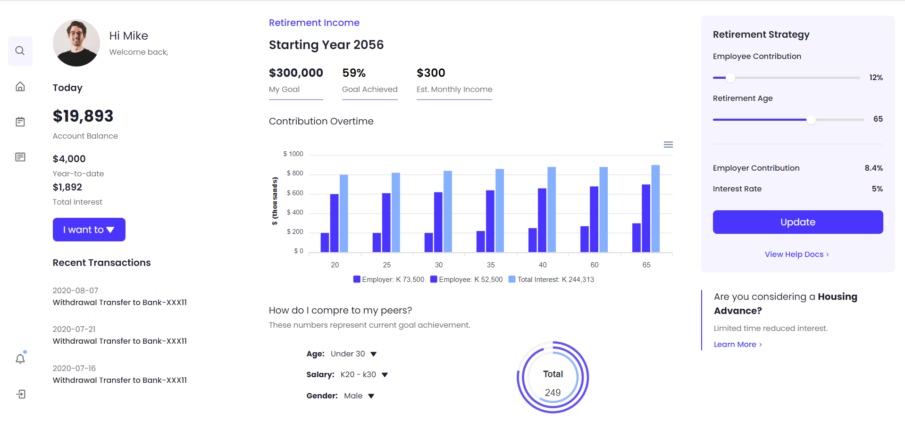
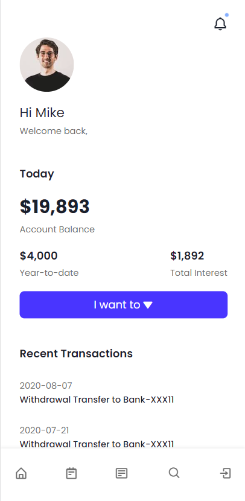

# Project Name

## Description

This project is a React-based user interface for a side navigation bar with various components to display user profile details, account balance, retirement income, recent transactions, and other relevant information. It includes responsive designs to cater to different screen sizes.

## Components

### SideNavbar

The `SideNavbar` component represents the main sidebar navigation. It dynamically adjusts its layout based on the screen size. When the screen size is less than 1000px, it displays a simplified version of the sidebar, and when it's larger, it shows additional features.

### LeftSide

The `LeftSide` component displays user profile details, account balance, and recent transactions. It conditionally shows a bell icon when the screen size is less than 800px and the 'bell' icon exists in the navigation data.

### MiddleSide

The `MiddleSide` component displays retirement income details and contribution over time using ApexCharts. It also compares the user's data to their peers using radial bar charts. The displayed content adapts to the screen size.

### RightSide

The `RightSide` component represents the retirement strategy section. It includes sliders to adjust employee contribution and retirement age, along with other relevant details. Users can update their strategy and view help documentation.

## Usage

To use this project, follow these steps:

1. Clone the repository to your local machine.
2. Install the necessary dependencies using `npm install`.
3. Run the application using `npm start`.
4. Access the application in your browser at `http://localhost:3000`.

## Screenshots

Provide screenshots of the user interface on different screen sizes to showcase the responsiveness and layout of the components.

## Authors

- [Your Name](https://github.com/yourusername)

## License

This project is licensed under the [MIT License](LICENSE). Feel free to use and modify it as needed.
